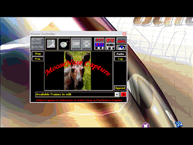



## CaptureScreen2AVI\-GIF

### Description

Update: Reference error fixed Updates: (03-28-08) Fixed some bugs and minor stuff (3-24-08): The color output has been corrected. Compatibility with Premiere Minus AVI txtCodeId=68993 has been added. MPG options removed. Vb-accelerator removed. Some bugs may persist.

Update (7-10-07) See the new animation. I've added panning which is a feature often seen in videos when a still image is panned from side to side. You can now Step Capture. This will save the selected screen area to an AVI and to an animated GIF. *** I need help adjusting the frame rate on the Step GIF's although Pause and Re-Start are good alternatives. Some of the functionality was borrowed from: txtCodeId=46847. Also, txtCodeId=50310 and Ray Mercer [http://www.shrinkwrapvb.com] for the BMP2AVI code. Make sure that you compile the included zip file to AVItoGIF.exe and put this in the app.path. Here's the limited documentation: [http://moosenose.com/Screen2AVI-GIF.htm] The flickering has been corrected and the cursor is captured again 7-14-05
 
### More Info
 

             |
---                |---
**Submitted On**   |2009-05-23 10:26:56
**By**             |[Warren Goff](https://github.com/Planet-Source-Code/PSCIndex/blob/master/ByAuthor/warren-goff.md)
**Level**          |Intermediate
**User Rating**    |4.9 (103 globes from 21 users)
**Compatibility**  |VB 6\.0
**Category**       |[Graphics](https://github.com/Planet-Source-Code/PSCIndex/blob/master/ByCategory/graphics__1-46.md)
**World**          |[Visual Basic](https://github.com/Planet-Source-Code/PSCIndex/blob/master/ByWorld/visual-basic.md)
**Archive File**   |[CaptureScr2152985232009\.zip](https://github.com/Planet-Source-Code/warren-goff-capturescreen2avi-gif__1-61619/archive/master.zip)

